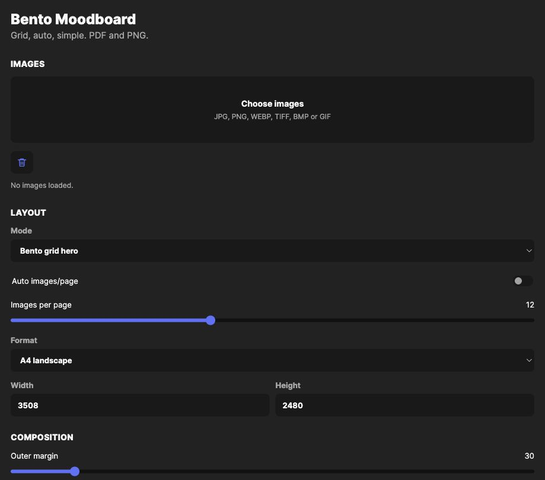

# Moodboard Purity 1

Local bento moodboard generator for PDF and PNG exports.



## Live Demo

https://cognitive-moodboard-beta.vercel.app

## Features

- Upload multiple images from the browser.
- Generate bento moodboards with grid, random, custom, organic, and simple layouts.
- Paint the custom bento grid cell-by-cell to merge same-color cells into blocks.
- Preview generated moodboards as scrollable PNG pages.
- Export PDF, PNG, or ZIP bundles.
- Dark mode is enabled by default.

## Local Run

```bash
python3 -m pip install -r requirements.txt
python3 moodboard_app.py
```

Open http://127.0.0.1:8787.

## Vercel

This repo includes Python serverless handlers under `api/` so the same UI can run on Vercel.
